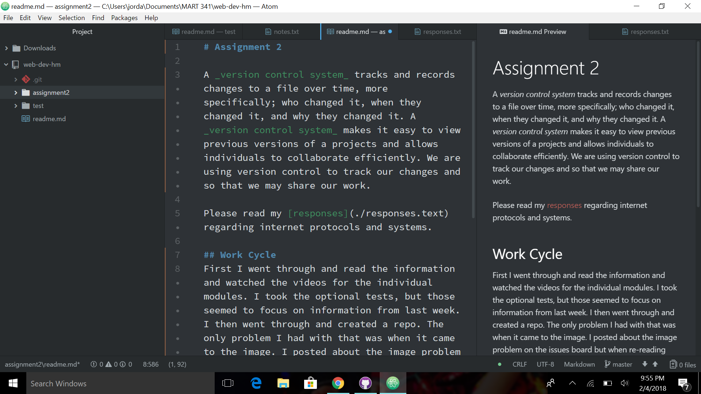

# Assignment 2

A _version control system_ tracks and records changes to a file over time, more specifically; who changed it, when they changed it, and why they changed it. A _version control system_ makes it easy to view previous versions of a projects and allows individuals to collaborate efficiently. We are using version control to track our changes and so that we may share our work.

[responses](./responses.text) 

## Work Cycle
First I went through and read the information and watched the videos for the individual modules. I took the optional tests, but those seemed to focus on information from last week. I then went through and created a repo. The only problem I had with that was when it came to the image. I posted about the image problem on the issues board but when re-reading others issues I saw someone had the same issue as myself. I did not captitalize the 'S' of screenshot which caused an error when viewing the repo from Git Desktop.  When it came time for the homework I missed the directions the first time through and created my assignment based on the picture that was available. I did this same thing last week. Next week I need to look for the directions first before attempting the assignment. I used Lightshot for screenshots which was fantastic, this will make my life much easier in the PC world.

