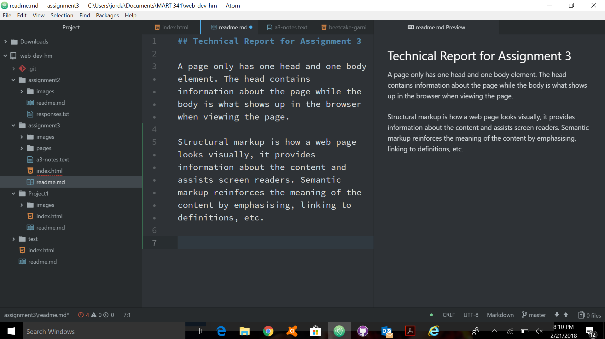

## Technical Report for Assignment 3

A page only has one head and one body element. The head contains information about the page while the body is what shows up in the browser when viewing the page.

Structural markup is how a web page looks visually, it provides information about the content and assists screen readers. Semantic markup reinforces the meaning of the content by emphasising, linking to definitions, etc.

Although this assignment was just as time consuming, because I am a beginner, I felt like I am kind of getting the hang of things. This was the first time I have not needed to post on the issues board. I was confused as to what constituted as secondary pages but luckily someone else asked a similar question and I was able to go from there. I was double checking the links toward the end of the assignment and found my pages were not linked properly. But after reviewing the learning modules I was able to figure it out. 

