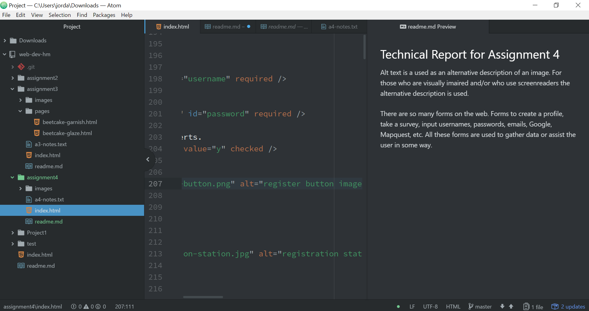

## Technical Report for Assignment 4

Alt text is a used as an alternative description of an image. For those who are visually imaired and/or who use screenreaders the alternative description is used.

There are so many forms on the web. Forms to create a profile, take a survey, input usernames, passwords, emails, Google, Mapquest, etc. All these forms are used to gather data or assist the user in some way.

This assignment was a challenge due to the fact that I did not have the same amount of time to dedicate to this class as I usually do. I was not able to run through all the modules and decided to dive right into the assignment. There was a lot of going back and forth between the assignment and the modules but I think it turned out well even though it was not the route I would have preferred to take. I was a little confused by where to put the code for the border but was able to go back through the modules and see that it needed to go in the head. I was also confused by the fact that the homework asked us to resize the registration station to be under 1,000kB but when I looked at the image it seemed it was under that size. Also when I added it to the site it looked like it was the correct size, so hopefully that was the right decision. I did not post any issues this week as I was able to problem solve on my own, other than that image issue. 

