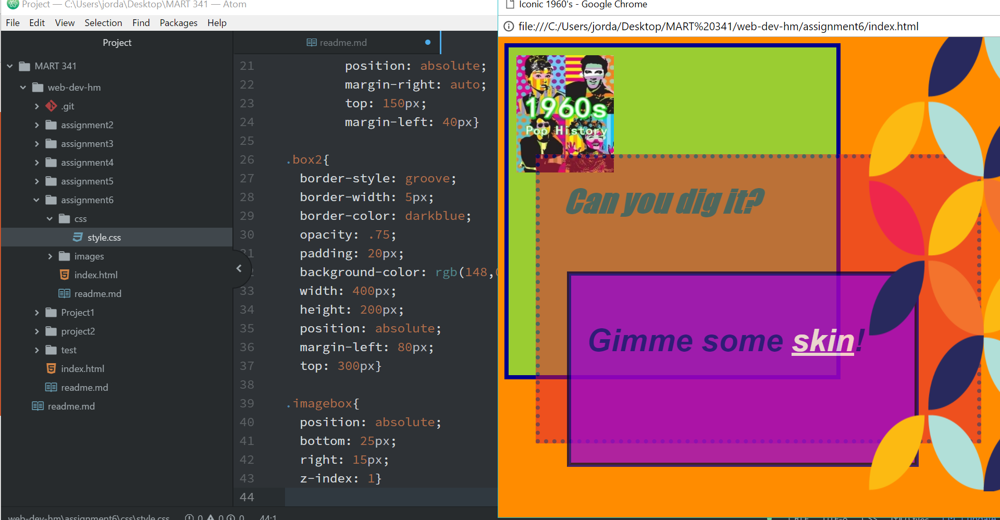

## Technical Report for Assignment 6##

As usual, before beginning, this assignment was very overwhelmig. I was not really sure what I wanted my design to look like, I could not envision anything. So I started by picking the image that appealed to me the most. That was an image from the 1960's. I then looked at the CSS colors and tried to find colors that would compliment the image I picked out. I googled images for the 1960's as well as common sayings and added those to my site.

I chose colors that complimented (at least in my mind) the image I chose from the 1960s. For my boxes I chose yellowgreen, crimson, and darkviolet. For the background I chose darkorange.

I went through the modules and they did not all make sense, like where exactly was I supposed to put some of the chaining selectors? On the style CSS sheet? Or the HTML portion? The biggest problem I had was getting my boxes to overlap. It took me over 2 hours to get them to overlap, but I did it! From there it was much easier. I really liked what I was able to do in CSS and am happy with how my site turned out.

