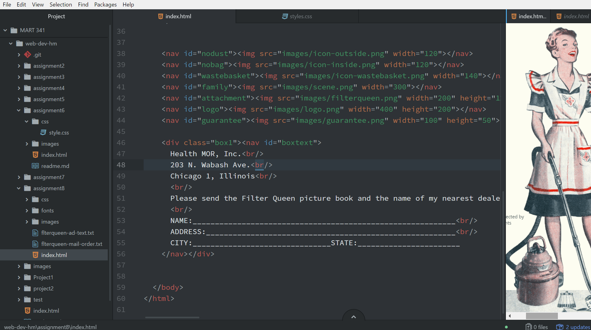

## Technical Report for Assignment 8

<b>As our course website states:</b>

Padding is the amount of space between the inner content of the element and the element itself.

The margin is the space between the box/element and other elements, or the edge of the parent element.

Borders help define the amount of space a box or element and can be colored or designed.

The hardest part of this assignment was getting the motivation to begin the assignment. I have been rather frustrated with the lack of communication and it is frustrating to not know whether I am doing the assignments correctly or not.

### Work Cycle
I began this assignment by going through the course website. I then Tried to start the assignment but was confused as to where things needed to go. I finally figured out there was a picture in the materials folder and that really helped. I ran into issues with getting things to overlap properly and issues with background colors. The only thing I have done in the online forum this week is chime in with others regarding the lack of grading and communication. 

